# 🏗️ Digital Enterprise Platform - High-Level Architecture

## 📊 System Overview

## 🔧 Repository Architecture

```mermaid
graph LR
    %% Repository Structure
    subgraph "Private Repository Structure"
        subgraph "Core Platform"
            CORE[digital-enterprise-core<br/>🏗️ Orchestration Hub<br/>📨 Messaging System<br/>🔄 Workflow Engine]
        end
        
        subgraph "Infrastructure"
            INFRA[enterprise-infrastructure<br/>🏗️ Terraform Modules<br/>☁️ AWS Deployment<br/>🐳 Docker Containers]
        end
        
        subgraph "Specialized Agents"
            PROD[enterprise-product-agent<br/>📋 Requirements Analysis<br/>📊 User Stories<br/>👥 Stakeholder Mgmt]
            
            SALES[enterprise-sales-agent<br/>🎯 Lead Scoring 94/100<br/>💰 Pipeline $2.75M<br/>📈 CRM Integration]
            
            MARKET[enterprise-marketing-agent<br/>📢 Content Generation<br/>📊 Campaign Mgmt 425% ROI<br/>🎨 AI-Powered Content]
        end
        
        subgraph "Demo & Extensions"
            DEMO[enterprise-demo-platform<br/>🖥️ React Frontend<br/>📊 Interactive Dashboard<br/>🎮 Tutorial System]
            
            EXT[enterprise-extensions<br/>🔌 Community Plugins<br/>🔗 Integrations<br/>🛠️ Custom Agents]
        end
    end

    %% Dependencies
    PROD --> CORE
    SALES --> CORE
    MARKET --> CORE
    DEMO --> CORE
    EXT --> CORE
    
    INFRA -.-> CORE
    INFRA -.-> PROD
    INFRA -.-> SALES
    INFRA -.-> MARKET
    INFRA -.-> DEMO

    %% Styling
    classDef coreRepo fill:#e3f2fd,stroke:#1976d2,stroke-width:3px
    classDef agentRepo fill:#e8f5e8,stroke:#388e3c,stroke-width:2px
    classDef infraRepo fill:#fff3e0,stroke:#f57c00,stroke-width:2px
    classDef demoRepo fill:#f3e5f5,stroke:#7b1fa2,stroke-width:2px
    
    class CORE coreRepo
    class PROD,SALES,MARKET agentRepo
    class INFRA infraRepo
    class DEMO,EXT demoRepo
```

## 🌐 Deployment Architecture

## 📊 Data Flow Architecture

## 🔐 Security Architecture

## 📈 Scalability & Performance

### Performance Characteristics
- **Response Time**: < 200ms for API calls
- **Throughput**: 10,000+ requests/minute
- **Concurrent Users**: 1,000+ simultaneous users
- **Agent Processing**: 100+ agents coordinated simultaneously
- **Data Processing**: Real-time analytics on large datasets

### Scalability Features
- **Horizontal Scaling**: Auto-scaling EKS node groups
- **Database Scaling**: Read replicas and connection pooling
- **Caching**: Multi-layer caching with Redis
- **CDN**: CloudFront for static assets
- **Message Queuing**: SQS for async processing

### High Availability
- **Multi-AZ Deployment**: Across 3 availability zones
- **Database Failover**: Automatic RDS failover
- **Load Balancing**: Application and network load balancers
- **Health Checks**: Kubernetes health and readiness probes
- **Backup & Recovery**: Automated backup with point-in-time recovery

---

## 🎯 Architecture Benefits

### **Modularity**
- Independent development and deployment of agents
- Clear separation of concerns
- Easy to add new agents and functionality

### **Scalability**
- Cloud-native architecture with auto-scaling
- Microservices approach for independent scaling
- Event-driven architecture for loose coupling

### **Security**
- Multi-layer security approach
- Enterprise-grade compliance and auditing
- Zero-trust security model

### **Maintainability**
- Clean code organization across repositories
- Comprehensive monitoring and observability
- Automated testing and deployment pipelines

### **Extensibility**
- Plugin architecture for community contributions
- Open APIs for third-party integrations
- Configurable agent behaviors and workflows

---

*Architecture Version: 1.0*  
*Last Updated: August 24, 2025*  
*Platform: Digital Enterprise AI Automation*
