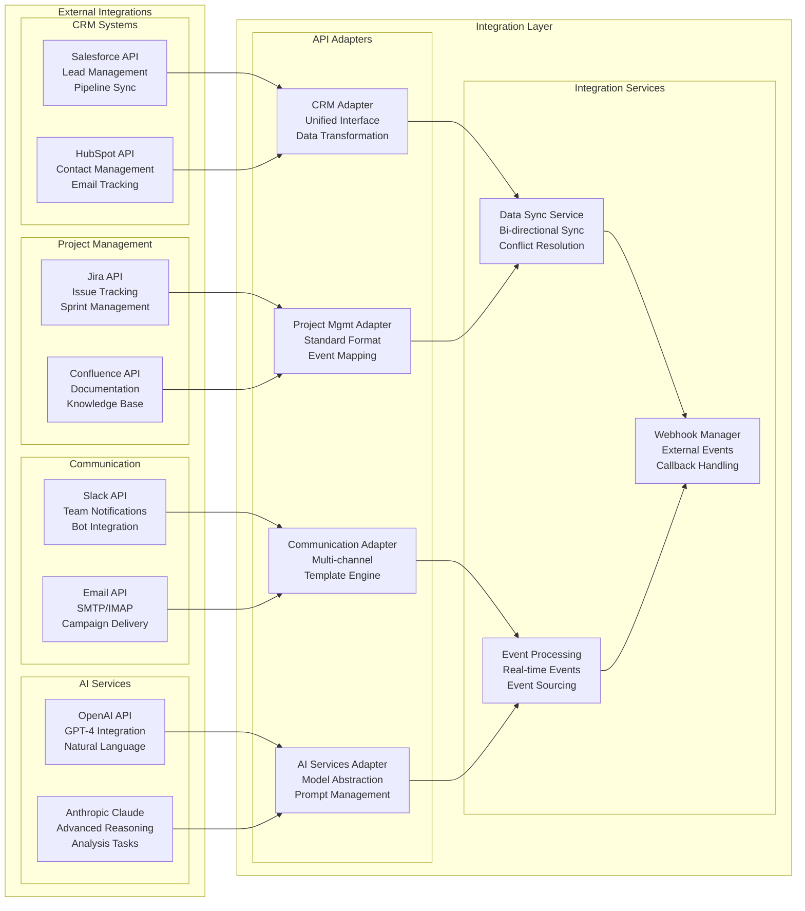
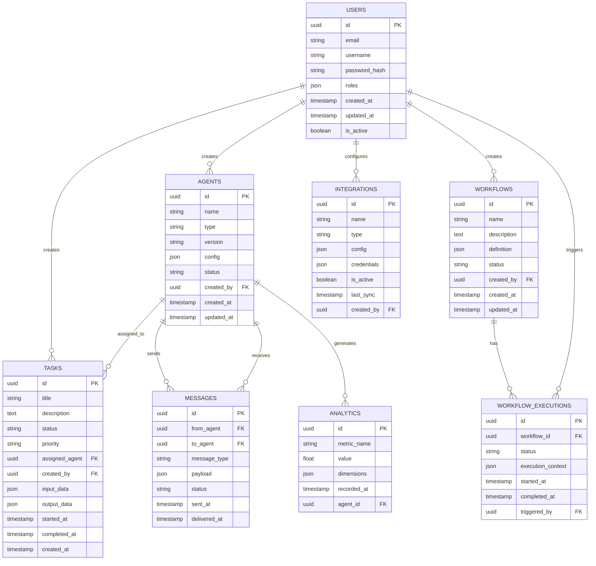

```mermaid
graph LR
    subgraph "Source Control"
        GITHUB[GitHub Repository<br/>Private Repos<br/>Branch Protection]
    end
    
    subgraph "CI/CD Pipeline"
        subgraph "Build Stage"
            LINT[Code Linting<br/>ESLint, Black<br/>Pre-commit Hooks]
            TEST[Unit Testing<br/>Jest, PyTest<br/>Coverage Reports]
            SECURITY[Security Scan<br/>Snyk, SAST<br/>Dependency Check]
        end
        
        subgraph "Package Stage"
            DOCKER[Docker Build<br/>Multi-stage Build<br/>Optimized Images]
            HELM[Helm Package<br/>Chart Templates<br/>Configuration]
        end
        
        subgraph "Deploy Stage"
            DEV_DEPLOY[Dev Deployment<br/>Auto Deploy<br/>Feature Testing]
            STAGE_DEPLOY[Staging Deploy<br/>Manual Approval<br/>Integration Testing]
            PROD_DEPLOY[Production Deploy<br/>Blue-Green<br/>Rollback Ready]
        end
    end
    
    subgraph "Infrastructure"
        TERRAFORM[Terraform<br/>Infrastructure as Code<br/>Multi-environment]
        K8S[Kubernetes<br/>Container Orchestration<br/>Auto-scaling]
        MONITORING[Monitoring<br/>Prometheus + Grafana<br/>Alert Manager]
    end

    GITHUB --> LINT
    LINT --> TEST
    TEST --> SECURITY
    SECURITY --> DOCKER
    DOCKER --> HELM
    HELM --> DEV_DEPLOY
    DEV_DEPLOY --> STAGE_DEPLOY
    STAGE_DEPLOY --> PROD_DEPLOY
    
    TERRAFORM --> K8S
    K8S --> MONITORING
    PROD_DEPLOY --> K8S
```

# 🔧 Technical Implementation Architecture

## 🏗️ Code Structure & API Design

```mermaid
graph TB
    subgraph "API Layer"
        subgraph "REST APIs"
            USER_API[User Management API<br/>/api/v1/users<br/>Authentication & Authorization]
            AGENT_API[Agent Management API<br/>/api/v1/agents<br/>Agent Lifecycle & Control]
            TASK_API[Task Management API<br/>/api/v1/tasks<br/>Workflow & Execution]
            ANALYTICS_API[Analytics API<br/>/api/v1/analytics<br/>Metrics & Reporting]
        end
        
        subgraph "WebSocket APIs"
            REALTIME_WS[Real-time Updates<br/>/ws/notifications<br/>Live Agent Status]
            AGENT_WS[Agent Communication<br/>/ws/agents<br/>Inter-agent Messaging]
        end
    end

    subgraph "Core Platform (digital-enterprise-core)"
        subgraph "Orchestration Hub"
            HUB_CORE[orchestration_hub.py<br/>OrchestrationHub Class<br/>Agent Coordination Logic]
            MSG_SYS[messaging_system.py<br/>MessageRouter Class<br/>Pub/Sub Implementation]
            WORKFLOW[workflow_engine.py<br/>WorkflowEngine Class<br/>Business Process Logic]
        end
        
        subgraph "Data Models"
            MODELS[models/<br/>SQLAlchemy Models<br/>Agent, Task, User, Workflow]
            SCHEMAS[schemas/<br/>Pydantic Schemas<br/>API Request/Response]
        end
        
        subgraph "Core Services"
            AUTH_SVC[auth_service.py<br/>JWT & OAuth Handler<br/>RBAC Implementation]
            CONFIG[config.py<br/>Environment Configuration<br/>Feature Flags]
        end
    end

    subgraph "Agent Implementations"
        subgraph "Product Agent (enterprise-product-agent)"
            PROD_MAIN[product_manager_agent.py<br/>ProductManagerAgent Class<br/>Requirements Processing]
            REQ_ANALYZER[requirement_analyzer.py<br/>RequirementAnalyzer Class<br/>AI-powered Analysis]
            STAKEHOLDER[stakeholder_manager.py<br/>StakeholderManager Class<br/>Communication Hub]
        end
        
        subgraph "Sales Agent (enterprise-sales-agent)"
            SALES_MAIN[sales_agent.py<br/>SalesAgent Class<br/>Lead Management]
            LEAD_SCORER[lead_scorer.py<br/>LeadScorer Class<br/>94/100 Accuracy]
            PIPELINE[pipeline_manager.py<br/>PipelineManager Class<br/>$2.75M Demo Pipeline]
        end
        
        subgraph "Marketing Agent (enterprise-marketing-agent)"
            MARKET_MAIN[marketing_agent.py<br/>MarketingAgent Class<br/>Campaign Management]
            CONTENT_GEN[content_generator.py<br/>ContentGenerator Class<br/>AI Content Creation]
            CAMPAIGN_MGR[campaign_manager.py<br/>CampaignManager Class<br/>425% ROI Optimization]
        end
    end

    subgraph "Frontend (enterprise-demo-platform)"
        subgraph "React Components"
            DASHBOARD[components/Dashboard.jsx<br/>Main Analytics Dashboard<br/>Real-time Metrics]
            AGENT_PANEL[components/AgentPanel.jsx<br/>Agent Control Interface<br/>Status & Controls]
            WORKFLOW_VIZ[components/WorkflowVisualizer.jsx<br/>Process Visualization<br/>Interactive Diagrams]
        end
        
        subgraph "State Management"
            REDUX[store/<br/>Redux Store<br/>Global State Management]
            API_CLIENT[services/api.js<br/>Axios Client<br/>API Integration]
        end
    end

    %% API Connections
    USER_API --> AUTH_SVC
    AGENT_API --> HUB_CORE
    TASK_API --> WORKFLOW
    ANALYTICS_API --> MODELS
    
    REALTIME_WS --> MSG_SYS
    AGENT_WS --> HUB_CORE
    
    %% Core Platform Connections
    HUB_CORE --> MSG_SYS
    HUB_CORE --> WORKFLOW
    MSG_SYS --> MODELS
    WORKFLOW --> SCHEMAS
    
    %% Agent Connections
    PROD_MAIN --> HUB_CORE
    SALES_MAIN --> HUB_CORE
    MARKET_MAIN --> HUB_CORE
    
    REQ_ANALYZER --> MSG_SYS
    LEAD_SCORER --> MSG_SYS
    CONTENT_GEN --> MSG_SYS
    
    %% Frontend Connections
    DASHBOARD --> ANALYTICS_API
    AGENT_PANEL --> AGENT_API
    WORKFLOW_VIZ --> TASK_API
    
    API_CLIENT --> USER_API
    API_CLIENT --> REALTIME_WS
    REDUX --> API_CLIENT

    %% Styling
    classDef apiClass fill:#e1f5fe,stroke:#01579b,stroke-width:2px
    classDef coreClass fill:#f3e5f5,stroke:#4a148c,stroke-width:2px
    classDef agentClass fill:#e8f5e8,stroke:#2e7d32,stroke-width:2px
    classDef frontendClass fill:#fff3e0,stroke:#e65100,stroke-width:2px
    
    class USER_API,AGENT_API,TASK_API,ANALYTICS_API,REALTIME_WS,AGENT_WS apiClass
    class HUB_CORE,MSG_SYS,WORKFLOW,MODELS,SCHEMAS,AUTH_SVC,CONFIG coreClass
    class PROD_MAIN,REQ_ANALYZER,STAKEHOLDER,SALES_MAIN,LEAD_SCORER,PIPELINE,MARKET_MAIN,CONTENT_GEN,CAMPAIGN_MGR agentClass
    class DASHBOARD,AGENT_PANEL,WORKFLOW_VIZ,REDUX,API_CLIENT frontendClass
```



## 🔗 Integration Architecture



## 📊 Database Schema



## 🚀 Deployment Pipeline



---

## 🎯 Implementation Highlights

### **Core Platform (digital-enterprise-core)**
```python
# orchestration_hub.py - Main coordination logic
class OrchestrationHub:
    async def coordinate_agents(self, task: Task) -> TaskResult:
        # Route to appropriate agent based on task type
        agent = self.get_optimal_agent(task.type)
        result = await agent.execute(task)
        await self.notify_stakeholders(result)
        return result
```

### **Agent Implementation Pattern**
```python
# Base agent structure used across all specialized agents
class BaseAgent:
    async def execute(self, task: Task) -> TaskResult:
        # 1. Validate input
        # 2. Process with AI if needed
        # 3. Execute business logic
        # 4. Store results
        # 5. Notify completion
        pass
```

### **API Design Pattern**
```python
# FastAPI route structure used across all services
@router.post("/api/v1/agents/{agent_id}/execute")
async def execute_agent_task(
    agent_id: str,
    task_data: TaskCreate,
    current_user: User = Depends(get_current_user)
) -> TaskResult:
    return await orchestration_hub.execute_task(agent_id, task_data)
```

### **Frontend State Management**
```javascript
// Redux store structure for real-time updates
const agentSlice = createSlice({
  name: 'agents',
  initialState: { agents: [], tasks: [], status: 'idle' },
  reducers: {
    updateAgentStatus: (state, action) => {
      // Real-time agent status updates
    }
  }
});
```

---

*Technical Architecture Version: 1.0*  
*Implementation Date: August 24, 2025*  
*Framework: FastAPI + React + Kubernetes*
