# 🔄 Complete Repository Transfer Plan - veerasgutta Organization

## 📊 Current Status
- ✅ Repository transfer initiated: avinshi/avinshi-ai-agent → veerasgutta/digital-enterprise-docs
- 🔄 Need to create: veerasgutta/veerasgutta-ai-agent (main development repo)

## 🎯 Two Repository Strategy

### Repository 1: `veerasgutta/digital-enterprise-docs` (Documentation Hub)
**Purpose**: Public-facing documentation and architecture hub
**Content**: 
- Architecture diagrams and documentation
- Open source strategy and roadmap
- Setup guides and migration documentation
- Links to private development repositories

### Repository 2: `veerasgutta/veerasgutta-ai-agent` (Main Development)
**Purpose**: Primary development repository with full codebase
**Content**:
- Complete agent implementations
- Development environment setup
- Full infrastructure code
- Demo applications and examples

## 🚀 Implementation Plan

### Step 1: Create New Main Repository
1. Go to https://github.com/veerasgutta
2. Click "New repository"
3. Repository name: `veerasgutta-ai-agent`
4. Description: "Digital Enterprise AI Platform - Main Development Repository"
5. Set to **Private** initially
6. Initialize with README
7. Create repository

### Step 2: Clone and Push Current Codebase
```powershell
# Create new directory for main development repo
cd C:\Veera\
git clone https://github.com/veerasgutta/veerasgutta-ai-agent.git
cd veerasgutta-ai-agent

# Copy all content from current workspace (excluding .git)
Copy-Item -Path "C:\Veera\Avinshi-Org\*" -Destination "." -Recurse -Exclude ".git"

# Add and commit all files
git add .
git commit -m "🚀 Initial commit: Complete Digital Enterprise AI Platform

Features:
- Product Management Agent with 95% accuracy
- Sales Agent with 94% lead scoring and $2.75M pipeline demo
- Marketing Agent with 425% ROI improvement
- Complete infrastructure automation with Terraform
- React demo platform with real-time updates
- Multi-agent orchestration system
- Enterprise integrations (CRM, Jira, Slack)

Repository Structure:
- agent-ecosystem/ - Specialized AI agents
- infrastructure/ - Terraform and AWS deployment
- ui/ - React frontend and demo platform
- backend/ - FastAPI services
- documentation/ - Comprehensive guides

Status: Ready for private development phase"

git push origin main
```

### Step 3: Update Documentation Repository
The `digital-enterprise-docs` repository should be cleaned up to focus on:
- Architecture documentation
- Public-facing strategy
- Links to main development repo

### Step 4: Repository Relationships

```mermaid
graph TB
    subgraph "Public Documentation"
        DOCS[veerasgutta/digital-enterprise-docs<br/>📚 Architecture & Strategy<br/>🌐 Public Access<br/>🔗 Links to Development]
    end
    
    subgraph "Private Development"
        MAIN[veerasgutta/veerasgutta-ai-agent<br/>💻 Full Development Environment<br/>🔒 Private Repository<br/>⚡ Active Development]
        
        CORE[veerasgutta/digital-enterprise-core<br/>🏗️ Core Platform]
        INFRA[veerasgutta/enterprise-infrastructure<br/>☁️ Infrastructure]
        AGENTS[veerasgutta/enterprise-*-agent<br/>🤖 Specialized Agents]
        DEMO[veerasgutta/enterprise-demo-platform<br/>🖥️ Demo Platform]
    end
    
    DOCS --> MAIN
    MAIN --> CORE
    MAIN --> INFRA
    MAIN --> AGENTS
    MAIN --> DEMO
```


## 🔧 Automated Setup Script

I'll create a script to automate this process:

```powershell
# Repository Setup and Transfer Script
param(
    [string]$GitHubToken = $env:GITHUB_TOKEN
)

Write-Host "🚀 Setting up veerasgutta organization repositories..." -ForegroundColor Cyan

# Step 1: Create main development repository
Write-Host "📦 Creating veerasgutta-ai-agent repository..." -ForegroundColor Green

# You'll need to create this manually on GitHub first
# Then clone and populate it

# Step 2: Clone new repository
$newRepoPath = "C:\Veera\veerasgutta-ai-agent"
Write-Host "📥 Cloning new repository..." -ForegroundColor Yellow
git clone https://github.com/veerasgutta/veerasgutta-ai-agent.git $newRepoPath

# Step 3: Copy content
Write-Host "📋 Copying complete codebase..." -ForegroundColor Yellow
Set-Location $newRepoPath

# Copy everything except .git
$sourceItems = Get-ChildItem "C:\Veera\Avinshi-Org" -Exclude ".git"
foreach ($item in $sourceItems) {
    Copy-Item $item.FullName -Destination . -Recurse -Force
}

# Step 4: Initial commit
Write-Host "💾 Creating initial commit..." -ForegroundColor Yellow
git add .
git commit -m "🚀 Initial commit: Complete Digital Enterprise AI Platform

🎯 Platform Features:
- Product Management Agent: 95% requirements analysis accuracy
- Sales Agent: 94% lead scoring, $2.75M pipeline management
- Marketing Agent: 425% ROI improvement, AI content generation
- Infrastructure: Complete Terraform automation for AWS
- Demo Platform: React frontend with real-time agent monitoring

🏗️ Architecture:
- Multi-agent orchestration system
- Enterprise integrations (Salesforce, Jira, Slack)
- Microservices with FastAPI and React
- Kubernetes deployment on AWS EKS
- Real-time messaging and WebSocket communication

📊 Repository Contents:
- agent-ecosystem/ - Core agent implementations
- infrastructure/ - Terraform modules and deployment
- ui/ - React demo platform and components
- backend/ - FastAPI services and APIs
- documentation/ - Architecture and setup guides
- tests/ - Comprehensive test suites

🚀 Status: Ready for private development and enterprise deployment"

git push origin main

Write-Host "✅ Repository setup complete!" -ForegroundColor Green
Write-Host "🌐 Main Development: https://github.com/veerasgutta/veerasgutta-ai-agent" -ForegroundColor Cyan
Write-Host "📚 Documentation Hub: https://github.com/veerasgutta/digital-enterprise-docs" -ForegroundColor Cyan
```

## 📋 Manual Steps Required

### 1. Create Main Repository
Go to https://github.com/veerasgutta and create:
- **Repository name**: `veerasgutta-ai-agent`
- **Description**: "Digital Enterprise AI Platform - Main Development Repository"
- **Visibility**: Private (initially)
- **Initialize**: With README

### 2. Verify Documentation Repository
Check that https://github.com/veerasgutta/digital-enterprise-docs is accessible

### 3. Execute Transfer
Once both repositories are created, I can execute the transfer script to:
- Clone the new main repository
- Copy all current development code
- Create comprehensive initial commit
- Set up proper repository relationships

## 🎯 Benefits of This Approach

✅ **Clear Separation**: Documentation vs Development
✅ **Professional Structure**: Clean public face with comprehensive development
✅ **Flexibility**: Can make main repo public when ready
✅ **Consistency**: All under veerasgutta organization
✅ **Scalability**: Proper foundation for team development

Would you like me to proceed with creating the repositories and executing the transfer?
